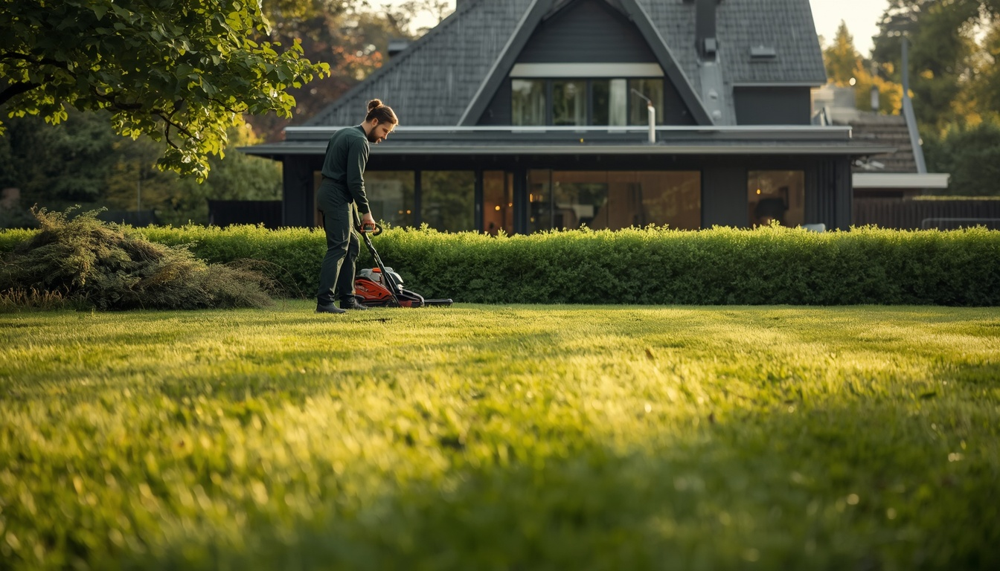
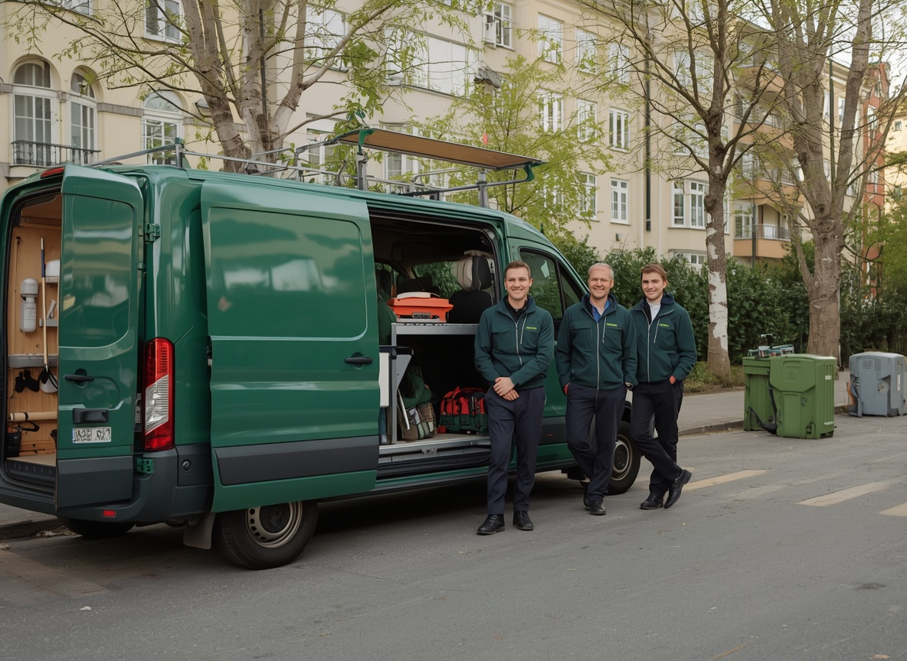
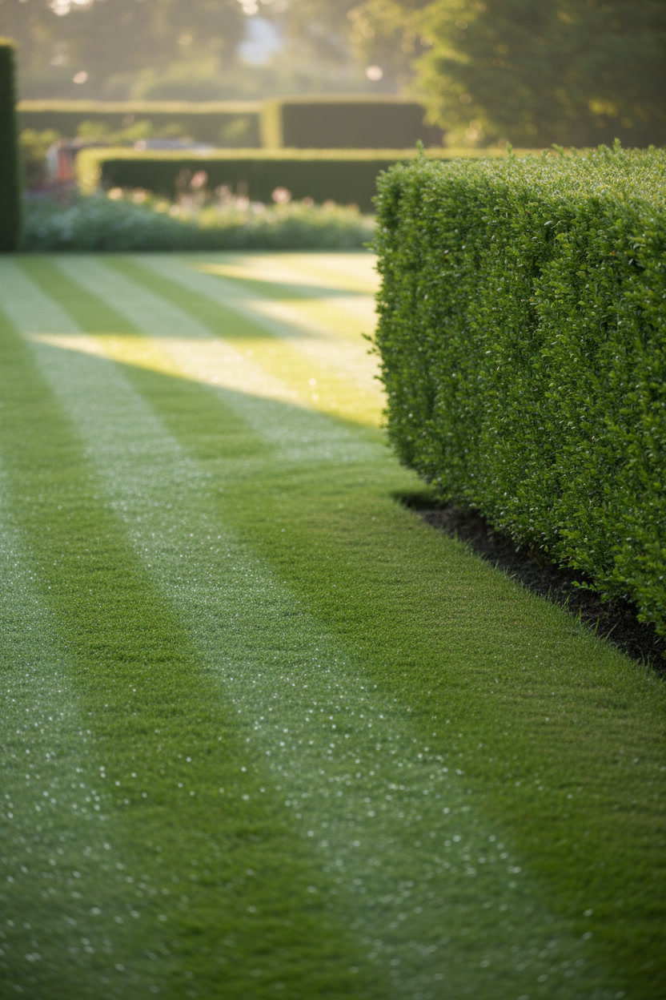

# Bildprompter — SS Trädgårdsservice AB

Färdiga prompter för att generera foton till webbplatsen (`index.html`).
Alla bilder delar samma stil så att sidan hänger ihop visuellt.

Palett att matcha: djup skogsgrön `#1E4D2B`, varm off-white `#FAF8F3`,
salvia `#A8BFA0`, dov guld `#D9A441`. Skandinavisk, naturligt ljus, miljö i
Solna/Stockholm. Undvik synliga ansikten (slipper modellavtal) och synliga logotyper.

---

## 1. Återanvändbar stil (klistra in sist i VARJE prompt)

```
Scandinavian editorial photography, natural soft daylight, deep forest-green and warm
off-white palette with muted sage and touches of warm gold, lush realistic greenery,
shallow depth of field, calm premium mood, high detail, photorealistic, no text, no logos,
no watermarks, no visible faces
```

Negativ prompt (om verktyget stödjer det):

```
cartoon, illustration, 3d render, oversaturated, HDR, lens flare, cluttered,
people looking at camera, brand logos, text overlays, distorted hands, blurry
```

---

## 2. Prompter per bild (lägg till stil-suffixet ovan)

### Hero  → `bilder/hero.jpg` · 16:9 (1920×1080)
```
Professional gardener in dark green workwear trimming a neat hedge in a lush Swedish
residential garden, golden morning light, striped freshly-mown lawn in foreground,
modern Scandinavian villa softly blurred behind
```

### Om oss  → `bilder/about.jpg` · 4:3 (1200×900)
```
Small team of Swedish landscapers in matching dark-green uniforms beside a green work van
with garden tools, suburban Stockholm street with birch trees, candid documentary daylight,
warm trustworthy mood
```

### Tjänst 1 – Trädgårdsskötsel  → `bilder/service-1.jpg` · 3:4 (900×1200)
```
Close-up of a striped freshly-mown lawn beside a trimmed green hedge, dew and morning light,
immaculate Swedish garden
```

### Tjänst 2 – Beskärning & trädvård  → `bilder/service-2.jpg` · 3:4
```
Arborist pruning an apple tree with professional secateurs, spring blossom, wooden ladder
against the trunk, crisp detail
```

### Tjänst 3 – Plantering & anläggning  → `bilder/service-3.jpg` · 3:4
```
Gloved hands planting colourful perennials into rich dark soil in a well-kept flowerbed,
trowel resting nearby, soft green bokeh
```

### Tjänst 4 – Höst- & vårstädning  → `bilder/service-4.jpg` · 3:4
```
Autumn garden cleanup, warm orange and gold fallen leaves, a rake and a neat leaf pile on
green grass, low golden-hour light
```

### Tjänst 5 – Snöröjning & halkbekämpning  → `bilder/service-5.jpg` · 3:4
```
Snow clearing on a residential walkway in a Swedish suburb, snow shovel, fresh snow capping
a hedge, soft overcast winter light, cool blue-white palette
```

### Tjänst 6 – Skötselavtal BRF  → `bilder/service-6.jpg` · 3:4
```
Immaculate courtyard garden outside a modern Swedish apartment building (BRF), neat lawn,
tidy path and a young tree, orderly and green
```

### OG-bild (delningsbild)  → `bilder/og.jpg` · 1.91:1 (1200×630)
```
Wide hero shot of a beautifully maintained Swedish garden, striped lawn and formal hedges,
golden hour, plenty of empty sky space on the left for a text overlay
```

---

## 3. Verktygsspecifika taggar

- **Midjourney:** lägg till `--ar 16:9` / `--ar 3:4` / `--ar 4:3` samt `--style raw --v 6`.
- **DALL·E 3 / GPT image:** skriv bildformatet i ord ("wide 16:9 photograph…").
- **Flux / Ideogram:** funkar direkt; lägg till "shot on 50mm, f/2.8" för finare skärpedjup.

---

## 4. Så byter du in bilderna i index.html

Lägg de genererade filerna i mappen `bilder/` med exakt namnen ovan. Byt sedan ut
SVG-illustrationerna mot ``. CSS:en sköter storlek och mörk gradient automatiskt.

**Hero** — ersätt hela `<svg class="hero-scene" id="hero-img">…</svg>` med:
```html

```

**Om oss** — ersätt hela `<svg class="about-scene" id="about-img">…</svg>` med:
```html

```

**Tjänstekort (1–6)** — ersätt varje `<svg class="service-bg">…</svg>` med (byt nummer):
```html

```

**OG-bild** — i `<head>`, byt `content="https://placehold.co/1200x630/…"` mot din
riktiga, publikt hostade URL (t.ex. `https://www.sstradgardsservice.se/bilder/og.jpg`).
OG-bilder måste ligga på en riktig URL — data-URI/lokala filer funkar inte för delning.

> Tills du byter in riktiga foton visas de inbäddade SVG-illustrationerna. De fungerar
> som fallback och kräver inga externa anrop.
